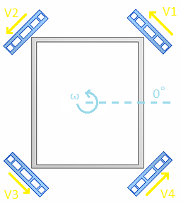
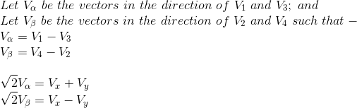
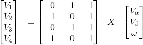
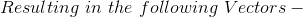
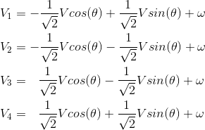

# Introduction
This library is to control a 4 Wheel Omni Drive in a D45 Arrangement as Shown in the Figure - 

This class is derived from [BotBase](../BotBase/) class.

## Information
### Testing
The Library is in Testing Stages.
- The *Wheels* are numbered in a Counter Clockwise sense from 1 to 4.
- Counter Clockwise Rotation is considered as Positive.

## Derivation of Equations 

It can be expressed in form of Matrices as follows -

# Users Guide

## Downloading the Library
It's suggested that you download the entire repository and then select the folders `D45Base` and `BotBase` (in case you haven't already imported it). This library depends upon the **BotBase** library (link [here](../BotBase/)).

## Using the library with Arduino
Move the folders into the *arduino libraries* folder on your PC. If you don't know where the libraries folder of your arduino installation is, you can check out the README file of this entire repository (click [here](../README.md)).

# Developers Guide
You're suggested to go through the **BotBase** documentation first, link [here](../BotBase/). 
## Library Details
### Files in the library
Let's first explore about all the files in this library

#### D45Base.h
This is the header file and contains the class blueprint (prototype). We will explore the details about the class soon.

#### D45Base.cpp
This is the file that contains the main code for the class. In the header file, only the function prototypes are mentioned, the code for the functions (definition) are present in this file.

#### keywords.txt
This file contains the keywords that we want the Arduino IDE to identify. This provides syntax highlighting features for the library for convenience of the programmer.

#### README.md
The description file containing details about the library. The file that you are looking at right now

### Class description
This library assumes the following :-
- You have a motor driver that requires only PWM and DIR (PWM and direction) signals to control the speed and direction of a motor.

This class is derived directly from the BotBase class (public inheritance).

#### Protected members
##### Variables
- **int \* angular_vel**: Angular Velocity for the Base. Default Value = 0.
- **int \* reverseDIRs**: An array of boolean values (one per wheel). If true, then the direction values will be reversed (check the convention from the diagram).

##### Member functions
- **void Move_PWM_Angle(int PWM, float angle)**: Function responsible for motion of the bot. The library sets the *PWM_values* and *DIR_values* from the *PWM* and *angle* passed. It also calls the *MoveMotor* function from the BotBase library.

#### Public members
##### Constructors
- **D45Base()**: Sets the Number of Wheels as Four.

##### Member Functions
- **void AssignPins(int \*PWM\_pins, int \*DIR\_PINs, bool \*reverseDIRs)**: Attaches the *PWM\_pins*, *DIR\_PINs* and *reverseDIRs* to the Bot Base.
- **void SetAngularVelocity(int angular_vel)**: Used to modify the Angular Velocity of the Base.
- **void Rotate(int pwm)**: Adds the Functionality of Rotating in the given configuration. Positive PWM applies Counter Clockwise Rotation and Negative PWM applies Clockwise Rotation.
- **void KillMotors()**: Used for bringing the Bot to Rest Motion.
